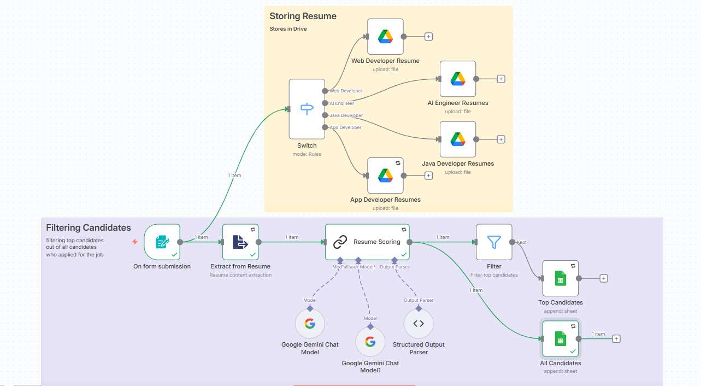
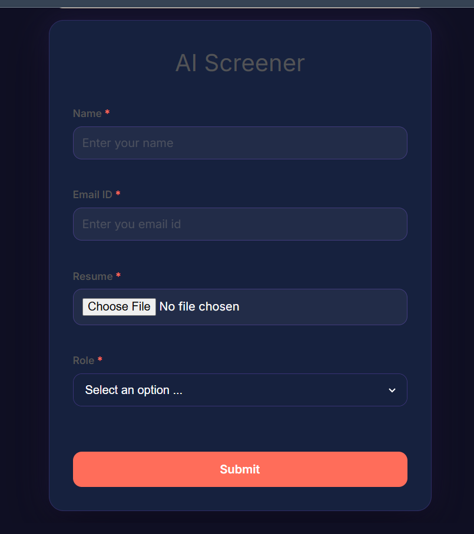
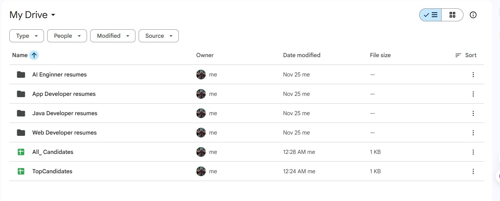

# AI-Powered Candidate Filtering Workflow

This workflow automates the candidate screening process, enabling efficient recruitment by leveraging **n8n**, **Google Gemini**, and **Google Workspace**. The system organizes resumes and intelligently scores them to identify top talent.

---

## Overview

This automated workflow streamlines the recruitment pipeline from application submission to candidate analysis:

1.  **Intelligent Intake**: Captures candidate details and resumes via a responsive web form.
2.  **Smart Organization**: Automatically sorts resumes into specific Google Drive folders based on the role (e.g., "Web Developer", "AI Engineer").
3.  **AI Analysis**: Uses **Google Gemini** to analyze resume content and score it against job requirements.
4.  **Data Centralization**: Logs every applicant in a master Google Sheet.
5.  **Top Talent Highlighting**: Identifies high-scoring candidates (>8.5/10) and adds them to a separate "Top Candidates" list with a summary of their strengths.

---

## Visual Workflow

The following image illustrates the complete automation process:

---

## Key Features

### 1. Modern Candidate Experience
Candidates apply through a clean, branded interface.

### 2. Automated File Management
Resumes are instantly routed to the correct folder in Google Drive, ensuring organized cloud storage.

### 3. Comprehensive Tracking
Every application is recorded for complete record-keeping.

### 4. AI-Driven Insights
The system filters for the best candidates. High-potential applicants are flagged and moved to a "TopCandidates" sheet, complete with an AI-generated highlights of their qualifications.

---

## How It Works

1.  **Trigger**: The workflow initiates when a candidate submits the **AI Screener Form**.
2.  **Route**: The system checks the selected "Role" (Web Dev, AI Engineer, etc.) and routes the data accordingly.
3.  **Upload**: The resume file is uploaded to the corresponding Google Drive folder.
4.  **Analyze**:
    *   Text is extracted from the PDF resume.
    *   **Google Gemini** analyzes the text for key skills and experience relevant to the role.
    *   It assigns a score (0-10) and generates a brief "highlight" summary.
5.  **Record**:
    *   **All** candidates are added to the *All Candidates* sheet.
    *   **If Score > 8.5**: The candidate is also added to the *Top Candidates* sheet.

---

## Getting Started

To run this workflow, the following are required:

*   **n8n**: A self-hosted or cloud instance of n8n.
*   **Google Cloud Console Project**: With Drive and Sheets APIs enabled.
*   **Google Gemini API Key**: To power the AI analysis.
*   **Google Drive & Sheets**: To store files and data.

Import the `Candidates_filtering.json` file into your n8n instance and configure your credentials to begin.
