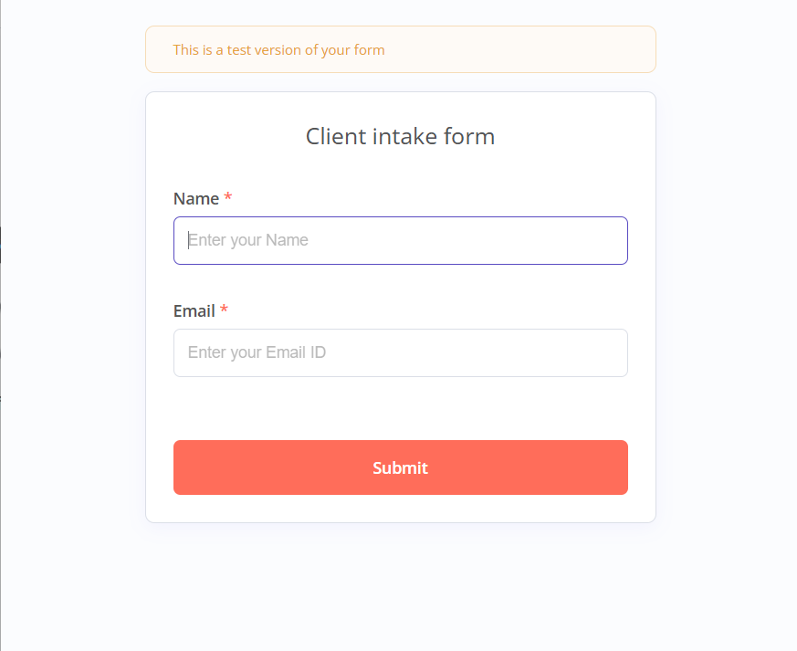
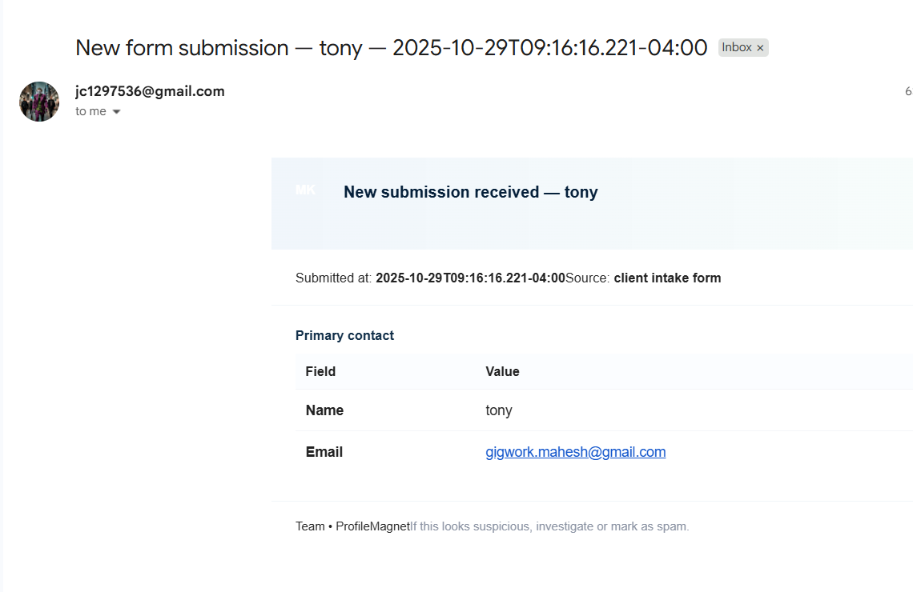
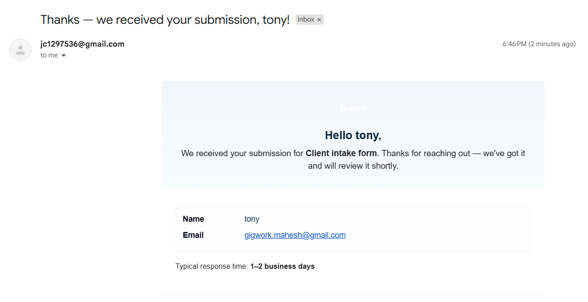
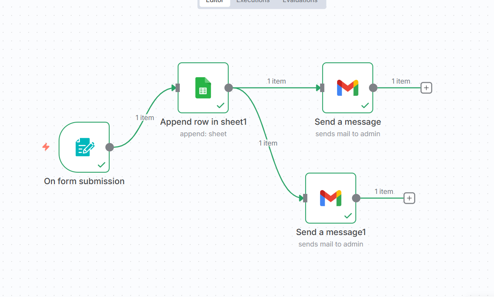

# Client Intake Automation Workflow

This n8n workflow automates the client intake process by capturing form submissions, storing them in Google Sheets, and sending notification emails.

## Workflow Overview

The workflow consists of the following steps:

1. **Form Trigger** - Captures client information through a web form
2. **Google Sheets** - Appends the submission data to a Google Sheet
3. **Gmail (Admin Notification)** - Sends a notification email to the admin
4. **Gmail (Client Confirmation)** - Sends a confirmation email to the client

## Setup Instructions

### Prerequisites

- n8n instance
- Google Sheets account with OAuth credentials
- Gmail account with OAuth credentials
- Drive account with OAuth credentials

### Credentials Setup

Before using this workflow, you need to set up the following credentials:

1. **Google Sheets OAuth2 API**
   - Create a Google Sheets OAuth2 credential in n8n
   - Replace `PLACEHOLDER_SHEET_ID` with your actual credential ID

2. **Gmail OAuth2**
   - Create a Gmail OAuth2 credential in n8n
   - Replace `PLACEHOLDER_GMAIL_ID` with your actual credential ID

### Google Sheet Configuration

1. Create a Google Sheet with columns: Name, Email, Time
2. Update the `documentId` and `sheetName` in the "Append row in sheet1" node with your sheet details
3. Replace `GOOGLE_SHEET_ID_PLACEHOLDER` with your actual Google Sheet ID
4. Replace `ADMIN_EMAIL_PLACEHOLDER` with the admin email address

## Workflow Visualization

### Client Intake Form

### Internal Notification Email sample

### Client Confirmation Email sample

## Workflow Diagram

## Nodes Details

### On form submission
- Type: Form Trigger
- Captures Name and Email from the client

### Append row in sheet1
- Type: Google Sheets
- Appends the form data to a Google Sheet

### Send a message
- Type: Gmail
- Sends notification to admin with submission details

### Send a message1
- Type: Gmail
- Sends confirmation to client

## Customization

You can customize the following aspects:

1. **Form Fields** - Add or modify fields in the "On form submission" node
2. **Email Templates** - Modify the HTML templates in the Gmail nodes
3. **Google Sheet Mapping** - Adjust column mappings in the Google Sheets node
4. **Email Recipients** - Update the "sendTo" field in the Gmail nodes

## Troubleshooting

If the workflow is not working as expected:

1. Check that all credentials are properly configured
2. Verify the Google Sheet document ID and sheet name
3. Ensure the Gmail addresses are correctly set
4. Check the n8n execution logs for error messages