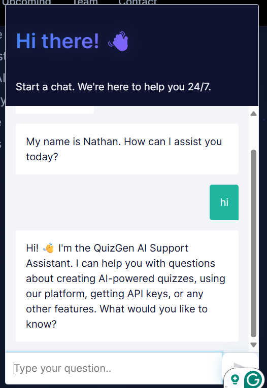
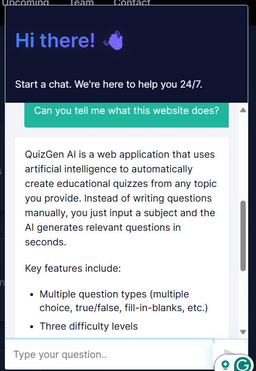
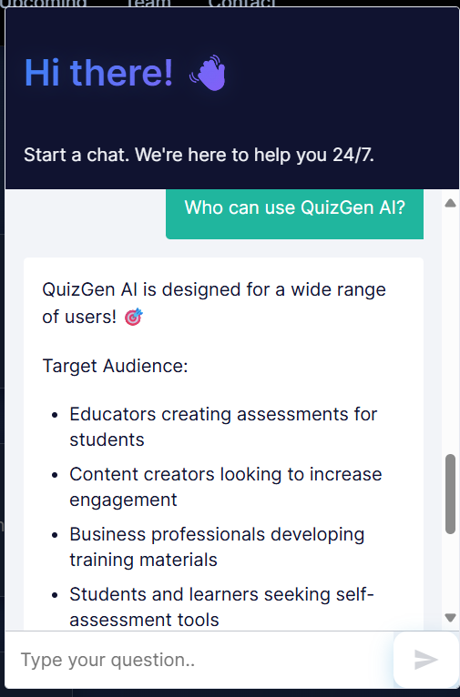
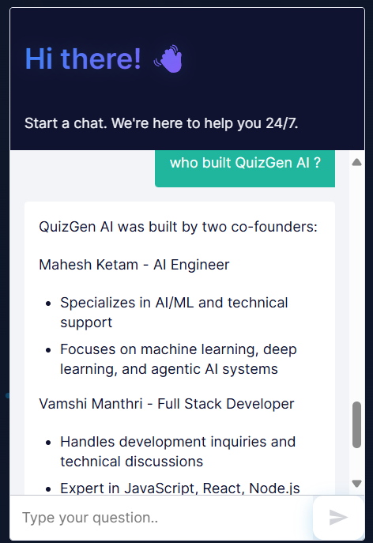
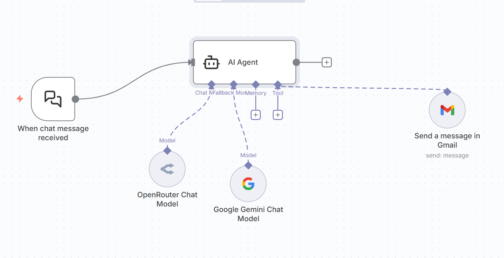

# QuizGen AI Support Chatbot

## Overview

The QuizGen AI Support Chatbot is the official chatbot for the QuizGen AI platform. It assists users by answering questions related to QuizGen AI's usage, features, setup, and help topics using provided context. The chatbot is designed to be short, clear, and friendly, providing descriptive replies. If a query cannot be answered based on the context, it responds with "Sorry, I can’t help you with that query." For unresolved issues or bugs, it can escalate by sending an email to the support team.

The chatbot integrates with AI language models to generate responses and uses tools like Gmail for escalation when necessary.

## Workflow

The chatbot workflow is built using n8n and operates as follows:

1. **Chat Message Trigger**: The workflow starts when a chat message is received via a webhook. This triggers the processing of the user's query.

2. **AI Agent Processing**: An AI agent receives the user query and processes it using a predefined prompt. The prompt includes context about QuizGen AI, such as its features, how it works, target audience, and contact information. The agent determines if the query can be answered from the context.

3. **Language Model Integration**: The agent uses AI language models (OpenRouter Chat Model and Google Gemini Chat Model) to generate responses. These models help in crafting accurate and helpful replies based on the context.

4. **Response or Escalation**:
   - If the query is answerable, the chatbot provides a direct response.
   - If it's an issue or bug not covered in the context, the agent uses the Gmail tool to send an email to the support team (nirikshan987654321@gmail.com and manthrivamshi1@gmail.com) with a clear subject and details.
   - Responses are streamed or provided directly, ensuring a smooth user experience.

5. **Output**: The final output is either a chat response or an email notification for further assistance.

This workflow ensures efficient support while maintaining security and relevance by sticking to the provided context.

## Features

- **Context-Based Responses**: Answers are limited to information about QuizGen AI, including its core purpose, key features (AI-powered generation, interactive quizzes, analytics, export), target audience, and how it works.
- **AI-Powered Assistance**: Utilizes advanced AI models for generating thoughtful replies.
- **Escalation Mechanism**: Automatically sends emails for unresolved technical issues or bugs.
- **User-Friendly Design**: Provides short, clear, and friendly interactions, with optional follow-ups when suitable.
- **Integration with Tools**: Leverages Gmail for support escalation and webhooks for chat integration.

## Images

### Chatbot Demos

Here are screenshots demonstrating the chatbot interface and interactions:

### Workflow Snapshot

This image shows the overall workflow structure in n8n:

