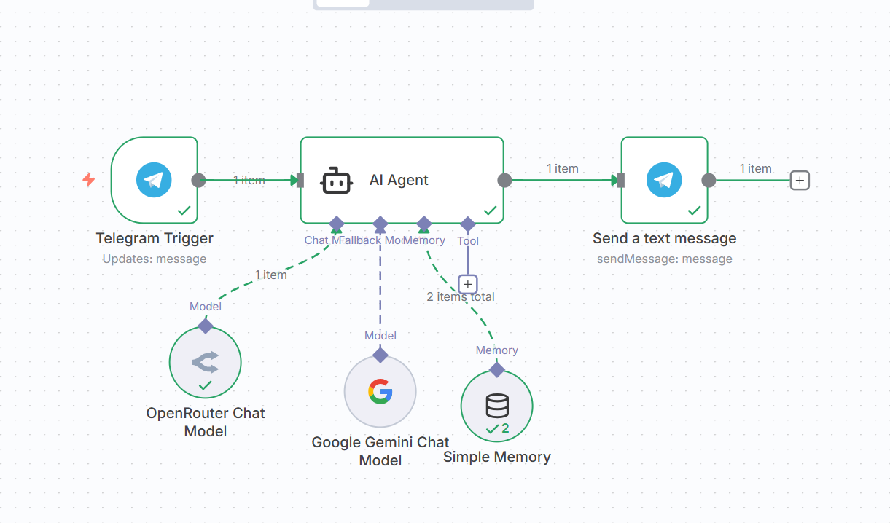

# Telegram Chat Assistant

A smart AI-powered assistant that responds to your messages directly in Telegram. This assistant provides quick, helpful responses to your queries and maintains context throughout your conversation.

## Features

- **Instant Responses**: Get immediate answers to your questions right in your Telegram app
- **Smart Conversations**: The assistant remembers your conversation history for more contextual responses
- **Polite & Helpful**: Designed to be courteous and ask follow-up questions when needed
- **Easy to Use**: Simply message the bot and get assistance without any complicated commands

## How It Works

1. Message the Telegram bot with any question or topic you'd like assistance with
2. The AI assistant processes your message and formulates a helpful response
3. Receive a polite, informative reply directly in your Telegram chat
4. Continue the conversation naturally - the assistant remembers what you've discussed

## Demo

Check out this video to see the assistant in action:

[Demo Video](ChatTLG_demo.mp4)

## Support

For issues, questions, or feedback, please contact the administrator at [nirikshan987654321@gmail.com](mailto:nirikshan987654321@gmail.com).